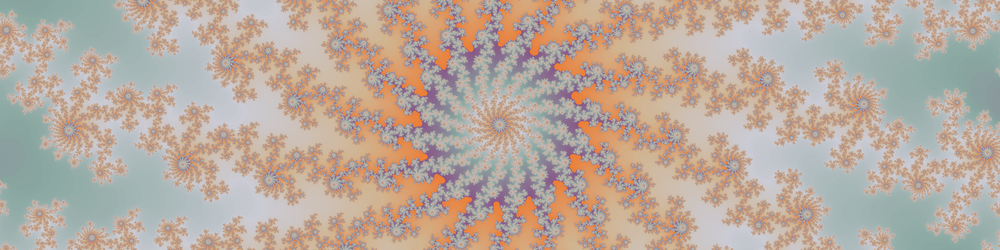
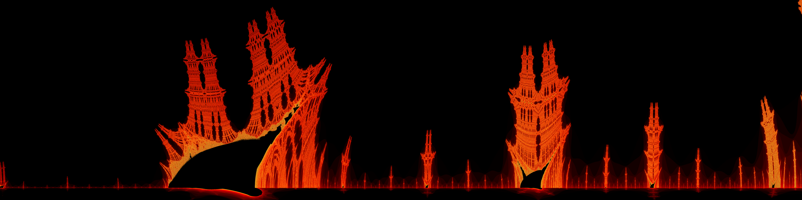
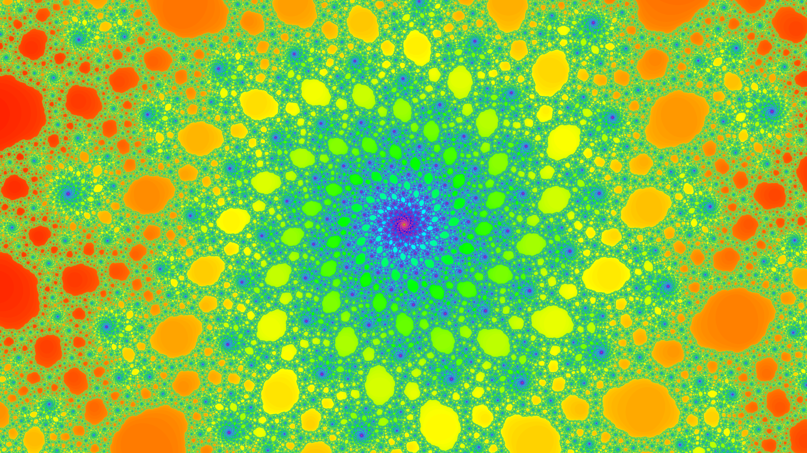
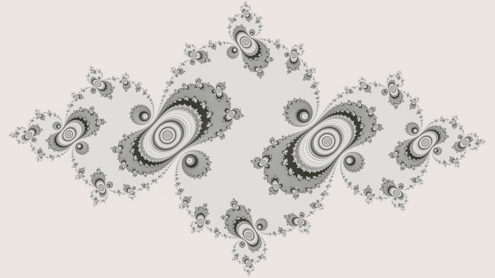
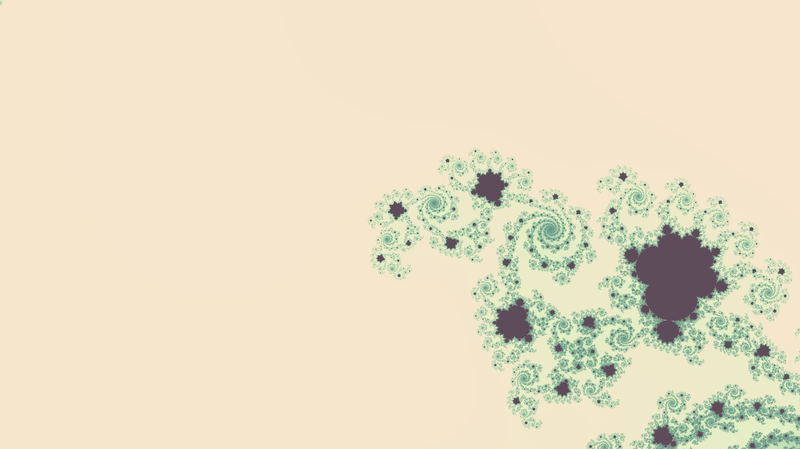
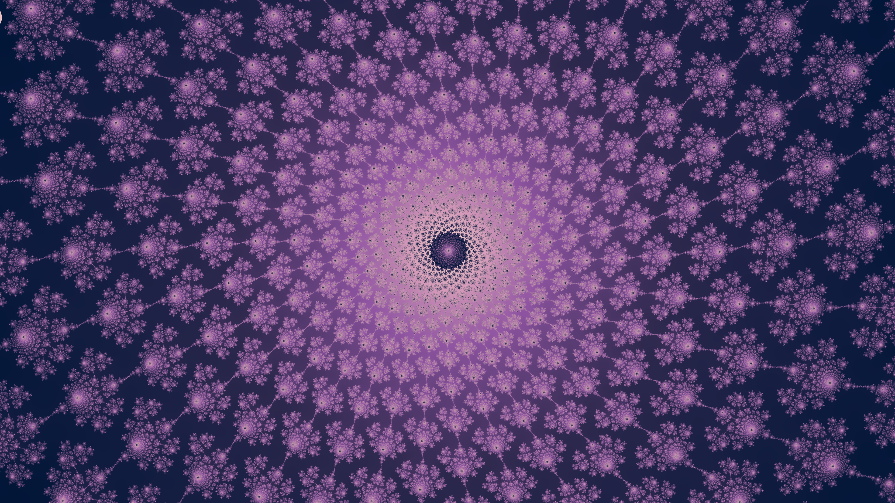
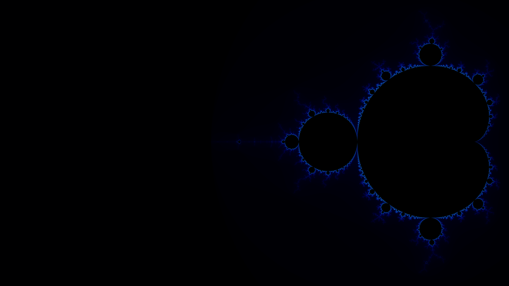
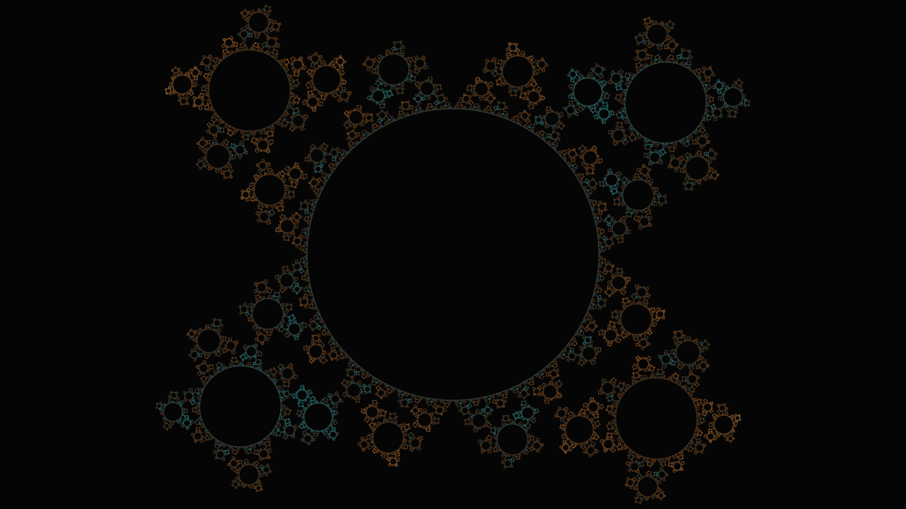
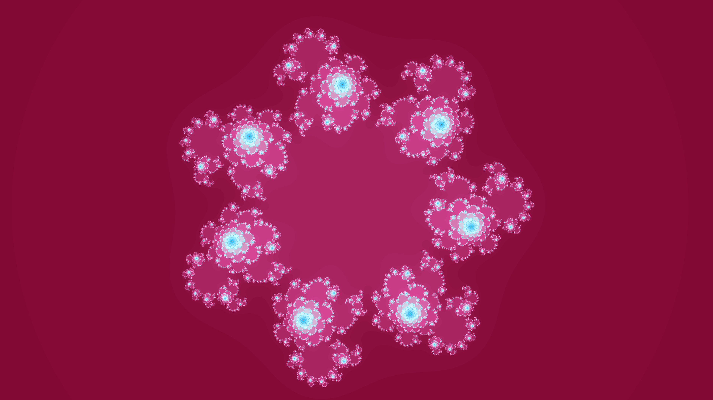
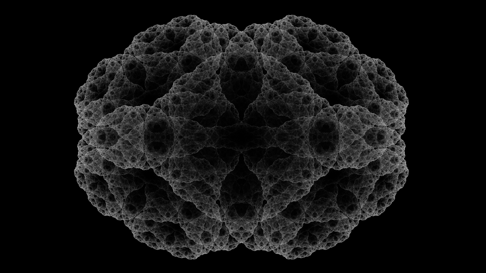

# Forma Fractalis - Interactive Fractal Explorer



**Explore, create, and render stunning fractals in Rust.** An interactive fractal explorer with real-time rendering, advanced color mapping, CLI automation, and professional export capabilities.

> **Non-programmers:** Pre-built Windows executables available on the [Releases page](https://github.com/ConociendoAlmasMenosHastiadas/forma-fractalis/releases)


---

## Key Features


### Interactive Exploration
- **12 Fractal Types**: Mandelbrot, Julia, Burning Ship, Tippets Mandelbrot, Multifractal-Julia, Cactus, Marek Dragon, Tetration, Lemon, Zubieta, Sin Julia, Insideout Dragon
- **Real-time Rendering**: Smooth 60 FPS with multi-threaded computation
- **Click-to-Zoom**: Intuitive mouse controls for navigation
- **Fractal Parameters**: Adjust Julia constants, powers, rotation angles with live sliders

### Advanced Coloring
- **14 Built-in Colormaps** powered by [scala-chromatica](https://github.com/ConociendoAlmasMenosHastiadas/scala-chromatica)
- **HSV Color Picker**: Interactive saturation-value plane, hue bar, hex and RGB inputs
- **Custom Gradient Editor**: Drag-and-drop color stops with HSV picker
- **Save/Load Colormaps**: Share your custom palettes as JSON
- **Color Modulation**: Period cycles, custom interior colors, logarithmic scaling

### Professional Export
- **High-Resolution PNG**: Scale up to 8K with Lanczos3/Gaussian filtering
- **8x Supersampling**: Ultra-sharp anti-aliased results
- **Complete Metadata**: All settings embedded in PNG tEXt chunks
- **Round-Trip Loading**: Import any exported PNG or JSON settings file
- **Animated GIF Export**: Zoom sequences and iteration-fade animations with GPU acceleration

### CLI Automation (New in v0.1.7!)
- **Headless Rendering**: Generate fractals without GUI
- **Batch Processing**: Render multiple resolutions from same settings
- **Parameter Overrides**: Change dimensions, iterations, scale via command-line
- **JSON Settings**: Export GUI settings for scripting and version control

---

## Quick Start



### Option 1: Pre-built Binary (Windows)
1. Download the latest zip from the [Releases page](https://github.com/ConociendoAlmasMenosHastiadas/forma-fractalis/releases)
2. Extract and run `forma-fractalis.exe`
3. Start exploring!

### Option 2: Build from Source
```bash
git clone https://github.com/ConociendoAlmasMenosHastiadas/forma-fractalis.git
cd forma-fractalis
cargo run --release
```

### GUI Mode
- **Navigate**: Click and drag to position zoom box, scroll to resize
- **Zoom**: Click to apply zoom
- **Colors**: Select from dropdown or create custom gradients
- **Export**: Set scale, choose directory, click "Export PNG"

### CLI Mode
```bash
# Render from PNG
forma-fractalis render -i input.png -o output.png

# Render from JSON with overrides
forma-fractalis render -i settings.json -o output.png --width 3840 --height 2160

# High-quality 4K render
forma-fractalis render -i input.png -o wallpaper.png --scale 3.0 --supersample 8

# Launch GUI with performance profiling
forma-fractalis --profiling
```

---

## Fractal Gallery

<table>
<tr>
<td width="50%">

### Zubieta


</td>
<td width="50%">

### Julia Set


</td>
</tr>
<tr>
<td width="50%">

### Tetration


</td>
<td width="50%">

### Powerbrot


</td>
</tr>
</table>

<details>
<summary><b>View more renders...</b></summary>

| Multifractal-Julia & Mandelbrot Variations |
|:--:|
|  |
|  |
|  |
|  |
|  |
|  |
|  |
|  |

</details>

---

## Usage Guide


### GUI Navigation & Controls

**Zoom & Pan:**
- Click and drag to position zoom box
- Scroll wheel to resize zoom box
- Click again to apply zoom
- "Reset View" button returns to default

**Color Customization:**
- Select built-in schemes from dropdown
- Open "Save/Load ColorMap" for custom gradients
- Drag color stops, edit RGB values, add/remove stops
- Save as JSON, load from file

**Export Options:**
- **Export PNG**: Renders full-quality image with metadata
- **Export Settings (JSON)**: Saves configuration for CLI use
- Scale factor controls output resolution (3.0 = 3x size)
- Choose output directory or use default

### CLI Workflow

**Design → Export → Batch Render**
```bash
# 1. Create settings in GUI, export as JSON
# 2. Render at multiple resolutions
forma-fractalis render -i fractal.json -o desktop_1080p.png --width 1920 --height 1080
forma-fractalis render -i fractal.json -o desktop_4k.png --width 3840 --height 2160
forma-fractalis render -i fractal.json -o poster_8k.png --width 7680 --height 4320
```

**CLI Options:**
- `-i, --input <FILE>` - PNG or JSON input
- `-o, --output <FILE>` - Output PNG path
- `--width/--height` - Override dimensions
- `--iterations` - Override iteration count
- `--scale` - Scaling factor
- `--supersample` - Anti-aliasing (1-16)
- `-p, --profiling` - Enable performance profiling output (GUI mode)

---

## GPU Acceleration

Forma Fractalis includes GPU compute shader support for significantly faster rendering of high-resolution exports.

### Backend Selection

Open the **Performance** section in the GUI sidebar to choose your rendering backend:

- **CPU Mode**: Uses f64 precision, supports all fractals, guaranteed compatibility
- **CPU Hi-Prec Mode**: Arbitrary-precision BigFloat (64-1024 bit) for deep zoom beyond f64 limits
- **GPU Mode**: Uses f32 precision via WGPU compute shaders, faster for large exports

The active backend is displayed in the status bar. GPU mode initializes when you first select it (takes ~100-200ms).

### Supported Fractals

GPU acceleration currently supports:
- Mandelbrot Set
- Powerbrot (configurable power)
- Zubieta
- Julia Set
- Sin Julia
- Burning Ship
- Insideout Dragon

Other fractals automatically use CPU rendering. GPU support will expand in future releases.

### Requirements

- **Graphics API**: Vulkan, DirectX 12, or Metal support
- **Drivers**: Up-to-date GPU drivers recommended
- **Tested on**: NVIDIA RTX 3000 series (should work on most modern GPUs)

### GPU Limitations

- **Precision**: GPU uses f32 (single precision) vs CPU f64 (double precision)
  - Visible precision loss at very deep zoom levels (>10^10)
  - For extreme zooms, use CPU mode or CPU Hi-Prec mode
- **Iteration Cap**: GPU rendering limited to 500,000 iterations for safety
  - Higher iteration counts automatically fall back to CPU
- **Memory**: Large exports automatically use tiled rendering
  - Exports >256 MB buffer size split into tiles
  - Tile size calculated based on your GPU's limits

### Troubleshooting

**GPU initialization fails:**
- Check GPU drivers are up-to-date
- Ensure graphics API support (Vulkan/DirectX 12/Metal)
- Fall back to CPU mode (always available)

**GPU rendering errors:**
- Error messages displayed in status bar
- Switch to CPU mode if GPU encounters issues
- Enable `--profiling` flag to see detailed GPU logs

**Export fails with GPU:**
- Very large exports (8K+) may exceed GPU memory
- Tiled rendering handles this automatically
- If issues persist, export with CPU mode

---

## Technical Details

**Project Structure (Cargo Workspace):**

Since v0.2.3, the project is split into two crates:

| Crate | Package | Purpose |
|-------|---------|---------|
| `core/` | `forma-fractalis-core` | Pure computation and rendering library (no GUI) |
| `gui/` | `forma-fractalis` | Interactive GUI application and CLI |

The core library can be used independently. See [core/README.md](core/README.md) for API documentation and usage.

**Built with:**
- [egui](https://github.com/emilk/egui) - Immediate mode GUI
- [wgpu](https://github.com/gfx-rs/wgpu) - GPU compute shaders (WebGPU)
- [Rayon](https://github.com/rayon-rs/rayon) - Parallel rendering
- [scala-chromatica](https://github.com/ConociendoAlmasMenosHastiadas/scala-chromatica) - Color gradients
- [clap](https://github.com/clap-rs/clap) - CLI argument parsing
- [image](https://github.com/image-rs/image) - Image processing

**Performance:**
- Multi-threaded rendering (full CPU utilization)
- Real-time 60 FPS GUI
- Optimized complex number calculations

**Documentation:**
- [core/README.md](core/README.md) - Core library API and usage
- [COLORMAP_SAVELOAD.md](COLORMAP_SAVELOAD.md) - ColorMap system details
- [METADATA_FORMAT.md](METADATA_FORMAT.md) - PNG metadata specification
- [CHANGELOG.md](CHANGELOG.md) - Version history

---

## Releases

**Latest: v0.2.4** (April 22, 2026)

Multi-Julia IFS fractal via inverse-iteration orbit accumulation (chaos game), GPU orbit accumulation compute shader (1D dispatch, atomic density histogram), CPU hi-precision orbit path with BigFloat, Burning Ship hi-precision support, GitHub Sponsors integration.



<details>
<summary><b>View release history...</b></summary>

### v0.2.4 (April 22, 2026)
- Multi-Julia IFS fractal: inverse-iteration chaos game (orbit accumulation, not escape-time)
- `orbit_accumulation.rs`: shared infrastructure — `DensityBuffer`, `AtomicDensityBuffer`, `OrbitTarget` trait, deterministic K=64 parallel sub-orbits
- GPU orbit accumulation: `orbit_common.wgsl` template + `multi_julia_ifs_orbit_kernel.wgsl`, 1D workgroup dispatch with `atomic<u32>` density histogram
- CPU hi-precision orbit path: BigFloat complex sqrt + BigFloat coordinate mapping
- Burning Ship hi-precision support (all bit widths 64–1024)
- OOM fix for supersampled orbit exports: automatic switch to `AtomicDensityBuffer` above 500 MB threshold
- GPU status indicator in GUI now correctly reports orbit-accumulation fractals as GPU-ready
- GitHub Sponsors integration (FUNDING.yml, README and index.html support section)
- Repository discoverability improvements (topics, description)

### v0.2.3 (April 3, 2026)
- Cargo workspace refactor: `forma-fractalis-core` (pure library) + `forma-fractalis` (GUI binary)
- Public API: `render_fractal_to_buffer()`, `compute_fractal_iterations()`, `colorize_iterations()`
- `FractalConfig` / `ColorConfig` / `ExportConfig` builder types for headless use
- `FractalIterations` cache type with `is_valid_for()` validity check
- `ColorConfig::with_color_offset()` builder for color animation loops
- GUI migrated from hand-rolled `IterationCache` to shared `FractalIterations`
- `color_offset` slider in GUI for live color phase shifting
- TippetsMandelbrot GPU shader (`tippets_mandelbrot_kernel.wgsl`)
- Julia Set `power` parameter (z_n^k + c) on all three backends: CPU f64, GPU f32, CPU hi-prec BigFloat
- Julia hi-prec: power=2 optimised path, general polar form for arbitrary exponents
- GPU test CLI subcommand (`gpu-test`) for automated GPU/CPU parity validation
- API documentation: module-level Quick Start, batch rendering guide, FractalConfig workflow docs

### v0.2.2 (March 28, 2026)
- Insideout Dragon fractal: z_{n+1} = z_n^2 + f(|z_n|) + i*g(|z_n|), z_0 = 1/c
- CPU Hi-Prec pipeline: arbitrary-precision rendering via astro-float BigFloat (64-1024 bit)
- BigFloat coordinate pipeline for clean rendering at extreme zoom (>1e15)
- HSV color picker: interactive SV plane, hue bar, hex and RGB text inputs
- Burning Ship GPU shader
- Insideout Dragon hi-precision support (BigFloat z^2, f64 perturbation)
- Mandelbrot hi-prec general power support (polar form complex exponentiation)
- Configurable CPU thread limit for CPU/CpuHiPrec backends
- Preview zoom control (0.1x-1.0x, auto-halved for CpuHiPrec)
- Hi-prec bits/max_threads propagated to export pipeline

### v0.2.1 (March 9, 2026)
- Sin Julia fractal: z_{n+1} = c·sin(z_n) with GPU acceleration (param_2 infrastructure)
- Animated GIF export: zoom sequences and iteration-fade animations
- GPU-accelerated animation frames (uses selected backend, initialized once per run)
- Logarithmic zoom interpolation for perceptually uniform zoom pacing
- Animation cancel button (stops mid-run, partial file deleted)
- Load from PNG or JSON (import dialog accepts both; routes by extension)
- Animation color settings fix (use_period, interior color, log scale now reach every frame)
- Animation export scale fix (export_scale was silently ignored)
- Colorstop endpoint fix via scala-chromatica v0.1.4 (inclusive period sampling)
- GPU/CPU selector changed to radio buttons
- GIF filename convention aligned with PNG (timestamp-based, filter suffix)

### v0.2.0 (February 27, 2026)
- GPU acceleration via WGPU (Mandelbrot/Powerbrot support)
- Zubieta fractal: z_{n+1} = z_n^2 + c/z_n (Julia variant with division)
- Polar/rectangular coordinate mode for complex parameters (Julia & Zubieta)
- Shader composition architecture (common.wgsl + per-fractal kernels)
- Tiled rendering for large GPU exports (>256 MB buffers)
- GPU safety: 500k iteration cap, explicit error handling
- Backend selection UI (CPU/GPU modes, no silent fallback)
- Unified rendering pipeline for preview and export
- 37% reduction in wgpu_backend.rs

### v0.1.9 (February 16, 2026)
- Lemon fractal: z_{n+1} = z_0 * z_n^2 * (z_n^2 + 1) / (z_n^2 - 1)^k
- Configurable denominator power (k=2 canonical, k=1 variant)
- Dependencies updated (rayon, clap, rfd, indicatif)
- Repository cleanup (AGENTS.md untracked, img_resources restructured)
- Documentation improvements (emoji removal, trimmed verbosity)

### v0.1.8 (February 15, 2026)
- Tetration fractal with 4 escape criteria modes
- Fractal equation visualization (LaTeX-style)
- Mandatory iteration cache (instant recoloring)
- GUI resize to 1730×820
- FractalGUI trait architecture (~287 lines removed)
- Performance profiling flag (--profiling)
- README showcase images

### v0.1.7 (February 14, 2026)
- Command-line rendering with progress indicators
- Export settings as JSON
- Marek Dragon fractal (z_{n+1} = exp(jφ)z_n + z_n²)
- State conversion refactoring (70% line reduction)
- scala-chromatica migration complete

### v0.1.61 (February 5, 2026)
- Colormap library extracted to scala-chromatica
- Framework-agnostic gradient system
- Deprecation path for bridge modules

### v0.1.6 (January 26, 2026)
- Load from PNG functionality
- Cactus fractal
- Vintage Lavender colormap
- PNG metadata documentation

### v0.1.5 (January 19, 2026)
- Multifractal-Julia with cycle detection
- Cosmic Dawn colormap
- Pixel-level parallelization (2-4x speedup)

### v0.1.4 (January 19, 2026)
- Powerbrot (configurable power)
- Benchmark suite
- Electric Neon colormap
- Input debouncing

</details>

See [CHANGELOG.md](CHANGELOG.md) for complete version history.

---

## Support

Forma Fractalis is maintained by one person in their spare time. It is free, always will be, and has no premium tier, no ads, and no telemetry. If you have found it useful and want to help keep development moving, a small donation goes a long way.

[Sponsor on GitHub](https://github.com/sponsors/ConociendoAlmasMenosHastiadas)

---

## License

Dual-licensed under **Apache-2.0** or **MIT** (your choice).  
See [THIRD_PARTY_LICENSES.md](THIRD_PARTY_LICENSES.md) for dependency licenses.

---

<p align="center">
Built with Rust 2021 | Palettes created with <a href="https://coolors.co">Coolors.co</a>
</p>