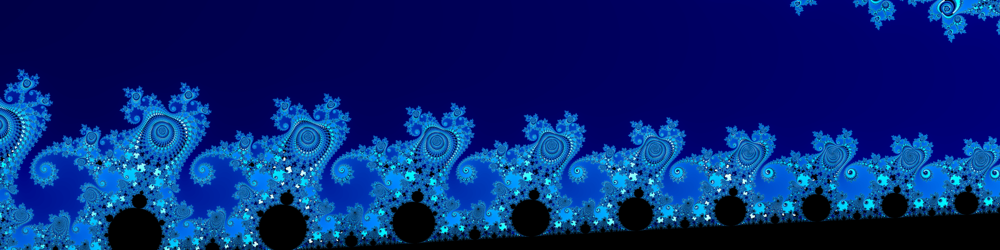
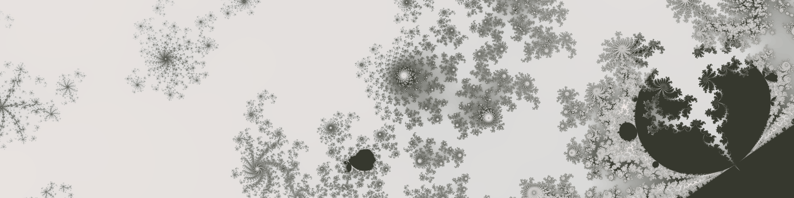
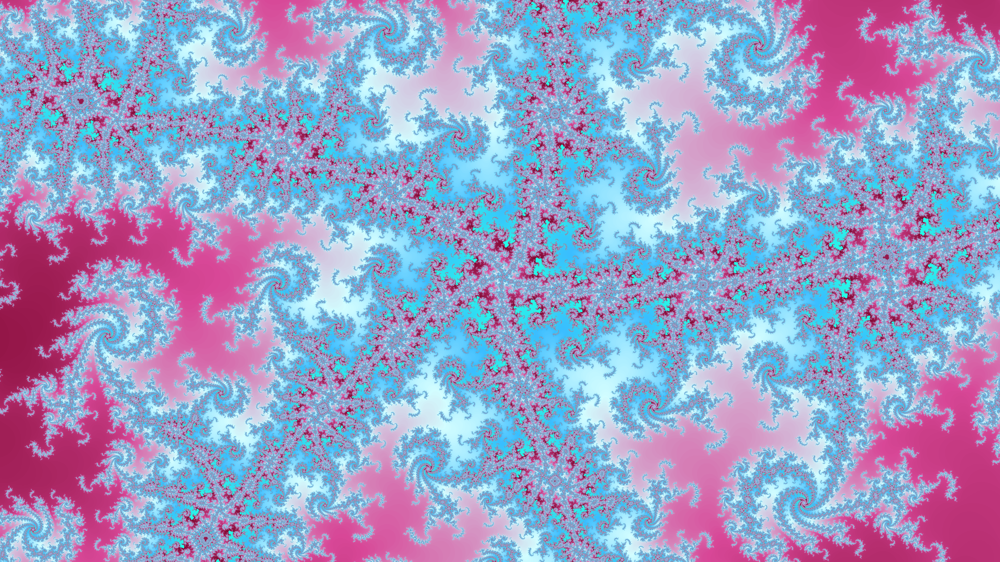
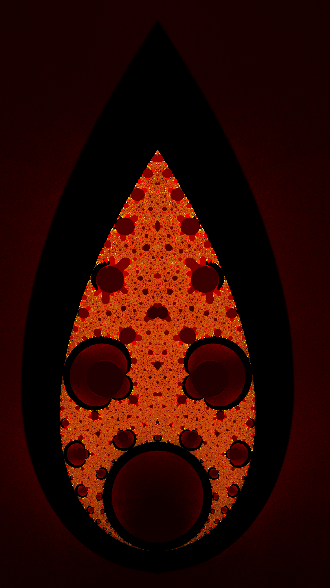
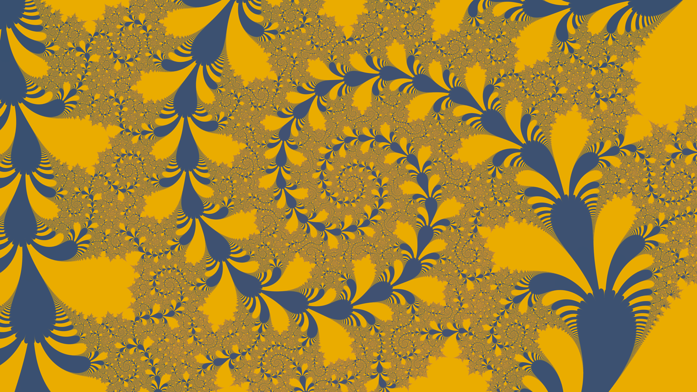
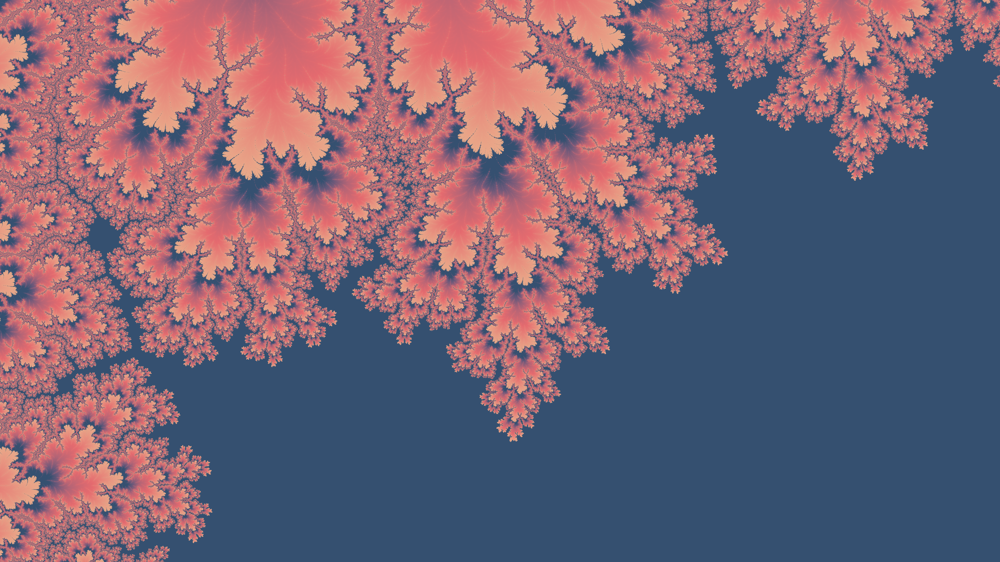

# Forma Fractalis - Interactive Fractal Explorer


**Explore, create, and render stunning fractals in Rust.** An interactive fractal explorer with real-time rendering, advanced color mapping, CLI automation, and professional export capabilities.

> *Perfect for wallpapers, digital art, and mathematical visualization*  
> **Pre-built Windows executables** available in [`builds/`](builds/)  
> **New in v0.1.7**: Command-line rendering and automation


---

## Key Features



### Interactive Exploration
- **7 Fractal Types**: Mandelbrot, Julia, Burning Ship, Tippets Mandelbrot, Multifractal-Julia, Cactus, Marek Dragon
- **Real-time Rendering**: Smooth 60 FPS with multi-threaded computation
- **Click-to-Zoom**: Intuitive mouse controls for navigation
- **Fractal Parameters**: Adjust Julia constants, powers, rotation angles with live sliders

### Advanced Coloring
- **14 Built-in Colormaps** powered by [scala-chromatica](https://github.com/ConociendoAlmasMenosHastiadas/scala-chromatica)
- **Custom Gradient Editor**: Drag-and-drop color stops with RGB precision
- **Save/Load Colormaps**: Share your custom palettes as JSON
- **Color Modulation**: Period cycles, custom interior colors, logarithmic scaling


### Professional Export
- **High-Resolution PNG**: Scale up to 8K with Lanczos3/Gaussian filtering
- **8x Supersampling**: Ultra-sharp anti-aliased results
- **Complete Metadata**: All settings embedded in PNG tEXt chunks
- **Round-Trip Loading**: Import any exported PNG to recreate exact settings

### CLI Automation (New in v0.1.7!)
- **Headless Rendering**: Generate fractals without GUI
- **Batch Processing**: Render multiple resolutions from same settings
- **Parameter Overrides**: Change dimensions, iterations, scale via command-line
- **JSON Settings**: Export GUI settings for scripting and version control



---

## Quick Start

### Option 1: Pre-built Binary (Windows)
1. Download `forma-fractalis_v0.1.7_windows.zip` from [`builds/`](builds/)
2. Extract and run `forma-fractalis.exe`
3. Start exploring!

### Option 2: Build from Source
```bash
git clone https://github.com/ConociendoAlmasMenosHastiadas/forma-fractalis.git
cd forma-fractalis
cargo run --release
```

### GUI Mode
- **Navigate**: Click and drag to position zoom box, scroll to resize
- **Zoom**: Click to apply zoom
- **Colors**: Select from dropdown or create custom gradients
- **Export**: Set scale, choose directory, click "Export PNG"

### CLI Mode
```bash
# Render from PNG
forma-fractalis render -i input.png -o output.png

# Render from JSON with overrides
forma-fractalis render -i settings.json -o output.png --width 3840 --height 2160

# High-quality 4K render
forma-fractalis render -i input.png -o wallpaper.png --scale 3.0 --supersample 8

# Launch GUI with performance profiling
forma-fractalis --profiling
```

---

## Fractal Gallery

<table>
<tr>
<td width="50%">

### Mandelbrot Set


</td>
<td width="50%">

### Julia Set


</td>
</tr>
<tr>
<td width="50%">

### Multifractal-Julia


</td>
<td width="50%">

### Tetration


</td>
</tr>
</table>

<details>
<summary><b>View more renders...</b></summary>

| Mandelbrot Variations |
|:--:|
|  |
|  |

</details>

---

## Usage Guide

### GUI  Navigation & Controls

**Zoom & Pan:**
- Click and drag to position zoom box
- Scroll wheel to resize zoom box
- Click again to apply zoom
- "Reset View" button returns to default

**Color Customization:**
- Select built-in schemes from dropdown
- Open "Save/Load ColorMap" for custom gradients
- Drag color stops, edit RGB values, add/remove stops
- Save as JSON, load from file

**Export Options:**
- **Export PNG**: Renders full-quality image with metadata
- **Export Settings (JSON)**: Saves configuration for CLI use
- Scale factor controls output resolution (3.0 = 3x size)
- Choose output directory or use default

### CLI Workflow

**Design → Export → Batch Render**
```bash
# 1. Create settings in GUI, export as JSON
# 2. Render at multiple resolutions
forma-fractalis render -i fractal.json -o desktop_1080p.png --width 1920 --height 1080
forma-fractalis render -i fractal.json -o desktop_4k.png --width 3840 --height 2160
forma-fractalis render -i fractal.json -o poster_8k.png --width 7680 --height 4320
```

**CLI Options:**
- `-i, --input <FILE>` - PNG or JSON input
- `-o, --output <FILE>` - Output PNG path
- `--width/--height` - Override dimensions
- `--iterations` - Override iteration count
- `--scale` - Scaling factor
- `--supersample` - Anti-aliasing (1-16)
- `-p, --profiling` - Enable performance profiling output (GUI mode)

---

## Technical Details

**Built with:**
- [egui](https://github.com/emilk/egui) - Immediate mode GUI
- [Rayon](https://github.com/rayon-rs/rayon) - Parallel rendering
- [scala-chromatica](https://github.com/ConociendoAlmasMenosHastiadas/scala-chromatica) - Color gradients
- [clap](https://github.com/clap-rs/clap) - CLI argument parsing
- [image](https://github.com/image-rs/image) - Image processing

**Performance:**
- Multi-threaded rendering (full CPU utilization)
- Real-time 60 FPS GUI
- Optimized complex number calculations

**Documentation:**
- [COLORMAP_SAVELOAD.md](COLORMAP_SAVELOAD.md) - ColorMap system details
- [METADATA_FORMAT.md](METADATA_FORMAT.md) - PNG metadata specification
- [CHANGELOG.md](CHANGELOG.md) - Version history

---

## Releases

**Latest: v0.1.8** (February 15, 2026)

Tetration fractal, equation visualization, mandatory iteration cache, GUI resize, FractalGUI trait architecture.

<details>
<summary><b>View release history...</b></summary>

### v0.1.8 (February 15, 2026)
- Tetration fractal with 4 escape criteria modes
- Fractal equation visualization (LaTeX-style)
- Mandatory iteration cache (instant recoloring)
- GUI resize to 1730×820
- FractalGUI trait architecture (~287 lines removed)
- Performance profiling flag (--profiling)
- README showcase images

### v0.1.7 (February 14, 2026)
- Command-line rendering with progress indicators
- Export settings as JSON
- Marek Dragon fractal (z_{n+1} = exp(jφ)z_n + z_n²)
- State conversion refactoring (70% line reduction)
- scala-chromatica migration complete
- 44 tests passing

### v0.1.61 (February 5, 2026)
- Colormap library extracted to scala-chromatica
- Framework-agnostic gradient system
- Deprecation path for bridge modules

### v0.1.6 (January 26, 2026)
- Load from PNG functionality
- Cactus fractal
- Vintage Lavender colormap
- PNG metadata documentation

### v0.1.5 (January 19, 2026)
- Multifractal-Julia with cycle detection
- Cosmic Dawn colormap
- Pixel-level parallelization (2-4x speedup)

### v0.1.4 (January 19, 2026)
- Powerbrot (configurable power)
- Benchmark suite
- Electric Neon colormap
- Input debouncing

</details>

See [CHANGELOG.md](CHANGELOG.md) for complete version history.

---

## 📄 License

Dual-licensed under **Apache-2.0** or **MIT** (your choice).  
See [THIRD_PARTY_LICENSES.md](THIRD_PARTY_LICENSES.md) for dependency licenses.

---

<p align="center">
Built with Rust 2021 | Palettes created with <a href="https://coolors.co">Coolors.co</a>
</p>